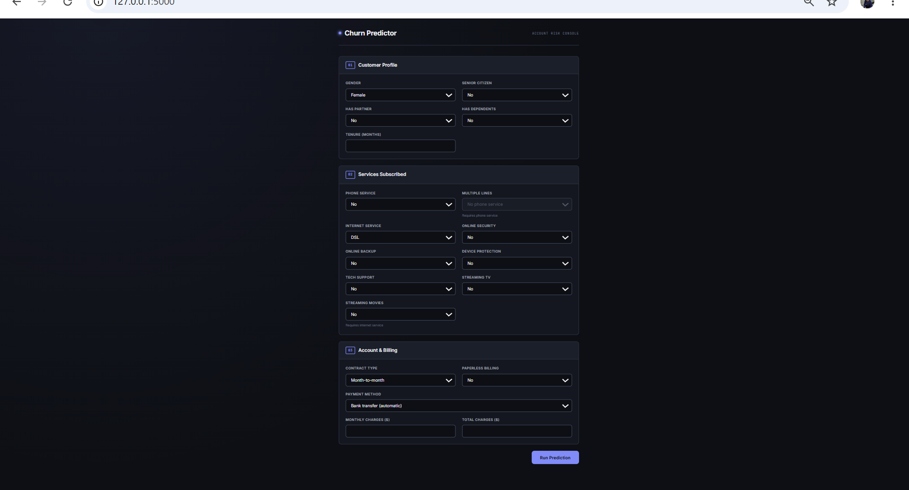
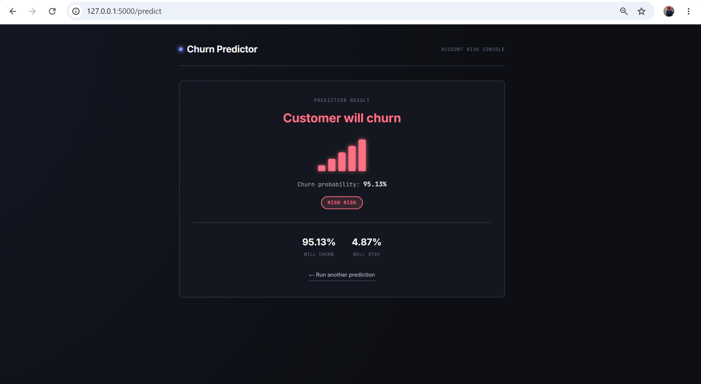

# Telco Customer Churn Predictor

A machine learning web application that predicts whether a telecom customer is likely to churn, built with Flask and scikit-learn. This project takes a churn prediction model from a Jupyter Notebook into a fully deployable web app with an interactive UI.

## Overview

- **Goal:** Predict whether a customer will churn (leave) or stay, based on their account and service details.
- **Model:** Logistic Regression (`C=10`, `penalty='l2'`), wrapped in a scikit-learn `Pipeline` with preprocessing.
- **Dataset:** Telco Customer Churn dataset (7,043 customers, 19 features after preprocessing).
- **Frontend:** Custom HTML/CSS UI styled as a "network operations console," with a signal-bar meter visualizing churn risk.

## Features

- Clean, responsive web form grouped into logical sections (Customer Profile, Services, Account & Billing)
- Dependent-field logic in the UI (e.g. disables "Streaming TV" options automatically if the customer has no internet service, matching how the model was trained)
- Displays both the prediction label and the churn probability percentage
- Input validation with friendly error messages instead of raw server errors
- Separation of concerns: web layer (`app.py`) is fully separate from ML logic (`src/prediction.py`)

## Project Structure
telco-churn-flask-app/
│
├── app.py                          # Flask routes (web layer)
├── requirements.txt                # Python dependencies
├── README.md
│
├── model/
│   └── telco_churn_pipeline.joblib # Trained preprocessing + classification pipeline
│
├── src/
│   ├── init.py
│   └── prediction.py               # Model loading + prediction logic
│
├── templates/
│   ├── index.html                  # Input form
│   └── result.html                 # Prediction result page
│
└── static/
└── style.css                   # App styling

## Model Details

The saved pipeline (`telco_churn_pipeline.joblib`) has two steps:

1. **Preprocessor** (`ColumnTransformer`)
   - `StandardScaler` on numeric features: `tenure`, `MonthlyCharges`, `TotalCharges`
   - `OneHotEncoder` on 16 categorical features (e.g. `Contract`, `InternetService`, `PaymentMethod`, etc.)
2. **Classifier**: `LogisticRegression`

Because preprocessing and the model are bundled into one `Pipeline`, the Flask app only needs to pass in a raw-format DataFrame — no manual encoding/scaling required at inference time.

## Screenshots


## Screenshots

### Input Form



### Prediction Result



## Setup & Local Installation
### 1. Clone or download the project

```bash
git clone <your-repo-url>
cd telco-churn-flask-app
```

### 2. Create a virtual environment (recommended)

```bash
python -m venv venv
source venv/bin/activate      # on Windows: venv\Scripts\activate
```

### 3. Install dependencies

```bash
pip install -r requirements.txt
```

### 4. Run the app

```bash
python app.py
```

The app will start on `http://127.0.0.1:5000/`. Open that URL in your browser, fill in the form, and click **Run Prediction**.

## Tech Stack

- **Backend:** Flask
- **ML:** scikit-learn, pandas, joblib
- **Frontend:** HTML5, CSS3 (no frontend framework — vanilla JS for dependent-field logic)

## Deployment

This app is designed to be deployed on platforms like **Render** or **PythonAnywhere**. See the deployment section of the project notes for platform-specific steps (WSGI entry point, environment variables, static file handling).

## Future Improvements

- Add SHAP-based explanations for predictions
- Add customer retention recommendations
- Improve UI with charts
- Deploy using Docker

## Author

Built by Talal Noor as part of an end-to-end ML deployment project — from a Jupyter Notebook model to a live web application.